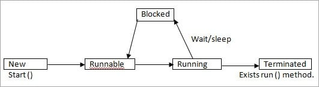

# Java interview questions

### Q1: What is Java?

> Difficulty : ⭐

Java is the high-level, object-oriented, robust, secure programming language, platform-independent, high performance, Multithreaded, and portable programming language. It was developed by James Gosling in June 1991. It can also be known as the platform as it provides its own JRE and API.

### Q2: List some features of Java?

> Difficulty : ⭐⭐

**1. OOPs concept:**

- Object oriented
- Inheritance
- Encapsulation
- Polymorphism
- Abstraction

**2. Platform independent:** A single program works on different platforms without any modification.
**3. High performance:** JIT (Just In Time compiler) enables high performance in Java. JIT converts the bytecode into machine language and then JVM starts the execution.
**4. Multi-threaded:** A flow of execution is known as a Thread. JVM creates a thread which is called main thread. The user can create multiple threads by extending the thread class or by implementing Runnable interface.

### Q3: What do you understand by Java virtual machine?
> Difficulty : ⭐⭐⭐

Java Virtual Machine is a virtual machine that enables the computer to run the Java program. JVM acts like a run-time engine which calls the main method present in the Java code. JVM is the specification which must be implemented in the computer system. The Java code is compiled by JVM to be a Bytecode which is machine independent and close to the native code.

### Q4: Difference between JDK, JRE, and JVM?

- **JVM(Java Virtual Machine):** A virtual machine that enables the computer to run the Java program.
- **JRE(Java Runtime Environment):** It is the implementation of JVM. The Java Runtime Environment is a set of software tools which are used for developing Java applications. It is used to provide the runtime environment.
- **JDK(Java Development Kit):** It is a software development environment which is used to develop Java applications and applets. It contains JRE + development tools.

### Q5: How many types of memory areas are allocated by JVM?

- **Class(Method) Area:** Class Area stores per-class structures such as the runtime constant pool, field, method data, and the code for methods.
- **Heap:** It is the runtime data area in which the memory is allocated to the objects
- **Stack:** Java Stack stores frames. It holds local variables and partial results, and plays a part in method invocation and return. Each thread has a private JVM stack, created at the same time as the thread. A new frame is created each time a method is invoked. A frame is destroyed when its method invocation completes.
- **Program Counter Register:** PC (program counter) register contains the address of the Java virtual machine instruction currently being executed.
- **Native Method Stack:** It contains all the native methods used in the application.

### Q6: Difference between Overriding and Overloading in Java?
> Difficulty : ⭐⭐

**1. Overriding**: Two methods with the same method name and parameters. One of the methods is in the parent class and the other is in the child class. Overriding allows a child class to provide a specific implementation of a method that is already provided its parent class.

**2. Overloading**: Two or more methods in one class have the same method name but different parameters.

### Q7: What is meant by Interface?
> Difficulty : ⭐⭐

An interface is a template which has only method declarations and not the method implementation.

Multiple inheritance cannot be achieved in java. To overcome this problem Interface concept is introduced.

### Q8: What is meant by Abstract class?
> Difficulty : ⭐⭐

An abstract class can have both “Abstract” methods and “Non-abstract” methods that are a concrete class.

### Q9: What is meant by Abstract method?
> Difficulty : ⭐⭐

The method which has only the declaration and not the implementation is called the abstract method and it has the keyword called “abstract”. Declarations are the ends with a semicolon.

### Q10: Difference between String, StringBuilder, and StringBuffer.
> Difficulty : ⭐⭐⭐

**1. String**: String variables are stored in “constant string pool”. Once the string reference changes the old value that exists in the “constant string pool”, it cannot be erased.

**2. StringBuffer**:
- Values are stored in a stack. If the values are changed then the new value replaces the older value. 
- Synchronized which is thread-safe.
- Performance is slower than the String Builder.

**3. StringBuilder**: This is same as String Buffer except for the String Builder which is not threaded safety that is not synchronized. So obviously performance is fast.

### Q11: Difference between Default and Protected access specifiers.
> Difficulty : ⭐⭐⭐

**1. Default**: Methods and variables declared in a class without any access specifiers are called default. For example:

```java
class Example {
    int number;

    int getNumber(){
        return this.number;
    }
}
```
Members in `Example` class is visible inside package and invisible outside package.

**2. Protected**: Protected is same as Default but if a class extends then it is visible even if it is outside the package.

```java
class Example {
    protected int number;

    protected int getNumber(){
        return this.number;
    }
}
```

### Q12: What is mean by Collections in Java?
> Difficulty : ⭐⭐⭐

Collection is a framework that is designed to store the objects and manipulate the design to store the objects and is used to perform following operations:
- Searching
- Sorting
- Manipulation
- Insertion
- Deletion

### Q12: What are the various access specifiers in Java?
> Difficulty : ⭐⭐

There're 4 accesses in Java:
- **Public**: The classes, methods, or variables which are defined as public, can be accessed by any class or method.
- **Protected**: Protected can be accessed by the class of the same package, or by the sub-class of this class, or within the same class.
- **Default**: Default are accessible within the package only. By default, all the - classes, methods, and variables are of default scope.
- **Private**: The private class, methods, or variables defined as private can be accessed within the class only.

### Q13: What is the purpose of static methods and variables?
> Difficulty : ⭐⭐

The methods or variables defined as static are shared among all the objects of the class. The static is the part of the class and not of the object. The static variables are stored in the class area, and we do not need to create the object to access such variables. Therefore, static is used in the case, where we need to define variables or methods which are common to all the objects of the class.

### Q14: What is the advantages of packages in Java?
> Difficulty : ⭐⭐

There are various advantages of defining packages in Java:
- Packages avoid the name clashes.
- The Package provides easier access control.
- We can also have the hidden classes that are not visible outside and used by the package.
- It is easier to locate the related classes.

### Q15: What is the output of the following Java program?
> Difficulty : ⭐⭐

```java
class Test   
{  
    public static void main (String args[])   
    {  
        System.out.println(10 + 20 + "Javatpoint");   
        System.out.println("Javatpoint" + 10 + 20);  
    }  
} 
```

<details>
  <summary><b>Answer</b></summary>
  <code>
    <p>30Javatpoint</p>
    <p>Javatpoint1020</p>
  </code>
</details>

### Q16: What is the output of the following Java program?
> Difficulty : ⭐⭐⭐

```java
class Test   
{  
    public static void main (String args[])   
    {  
        System.out.println(10 * 20 + "Javatpoint");   
        System.out.println("Javatpoint" + 10 * 20);  
    }  
}   
```

<details>
  <summary><b>Answer</b></summary>
  <code>
    <p>200Javatpoint</p>
    <p>Javatpoint200</p>
  </code>
</details>

### Q16: What is the output of the following Java program?
> Difficulty : ⭐⭐⭐⭐

```java
class Test   
{  
    public static void main (String args[])   
    {  
        for(int i=0; 0; i++)   
        {  
            System.out.println("Hello Javatpoint");  
        }  
    }  
}   
```

<details>
  <summary><b>Answer</b></summary>
  <p>
    The above code will give the compile-time error because the for loop demands a boolean value in the second part and we are providing an integer value.
  </p>
</details>

### Q17: What is the constructor?
> Difficulty : ⭐⭐

The constructor can be defined as the special type of method that is used to initialize the state of an object. It is invoked when the class is instantiated, and the memory is allocated for the object. Every time, an object is created using the new keyword, the default constructor of the class is called.

### Q18: How many types of constructors are used in Java?
> Difficulty : ⭐⭐

- **Default Constructor**: default constructor is the one which does not accept any value. The default constructor is mainly used to initialize the instance variable with the default values.

- **Parameterized Constructor**: The parameterized constructor is the one which can initialize the instance variables with the given values. In other words, we can say that the constructors which can accept the arguments are called parameterized constructors.

### Q19: Does constructor return any value?
> Difficulty : ⭐⭐⭐

Yes, The constructor implicitly returns the current instance of the class

### Q20: Is constructor inherited?
> Difficulty : ⭐⭐⭐

No, The constructor is not inherited.

### Q21: Can you make a constructor final?
> Difficulty : ⭐⭐⭐

No, the constructor can't be final.

### Q22: Can we overload the constructors?
> Difficulty : ⭐⭐⭐

Yes, the constructors can be overloaded by changing the number of arguments accepted by the constructor or by changing the data type of the parameters.

### Q23: What is the output of the following Java program?
> Difficulty : ⭐⭐⭐⭐

```java
class Test   
{  
    int i;   
}  
public class Main   
{  
    public static void main (String args[])   
    {  
        Test test = new Test();   
        System.out.println(test.i);  
    }  
}
```
<details>
  <summary><b>Answer</b></summary>
  <code>
    0
  </code>
  <p>
    The output of the program is 0 because the variable i is initialized to 0 internally. As we know that a default constructor is invoked implicitly if there is no constructor in the class, the variable i is initialized to 0 since there is no constructor in the class.
  </p>
</details>

### Q23: What is the output of the following Java program?
> Difficulty : ⭐⭐⭐⭐

```java
class Test   
{  
    int test_a, test_b;  
    Test(int a, int b)   
    {  
    test_a = a;   
    test_b = b;   
    }  
    public static void main (String args[])   
    {  
        Test test = new Test();   
        System.out.println(test.test_a+" "+test.test_b);  
    }  
}  
```
<details>
  <summary><b>Answer</b></summary>
  <p>
    There is a compiler error in the program because there is a call to the default constructor in the main method which is not present in the class. However, there is only one parameterized constructor in the class Test. Therefore, no default constructor is invoked by the constructor implicitly.
  </p>
</details>

### Q24: What are the restrictions that are applied to the Java static methods?
> Difficulty : ⭐⭐⭐

- The static method can not use non-static data member or call the non-static method directly.

- `this` and `super` cannot be used in static context as they are non-static.

### Q25: Why is the main method static?
> Difficulty : ⭐⭐⭐

If we make the main method non-static, JVM will have to create its object first and then call main() method which will lead to the extra memory allocation.

### Q26: Can we override the static methods?
> Difficulty : ⭐⭐⭐

No, we can't override static methods.

### Q27: What is the static block?
> Difficulty : ⭐⭐⭐

Static block is used to initialize the static data member. It is executed before the main method, at the time of classloading. For Example:

```java
class Test{  
  static{
    System.out.println("static block is invoked");
  }  

  public static void main(String args[]){  
   System.out.println("Hello main");  
  }  
}  
```

The output is:
```
static block is invoked
Hello main
```

### Q28: Can we execute a program without `main()` method?
> Difficulty : ⭐⭐⭐

Yes, one of the ways to execute the program without the main method is using static block.

### Q29: What is `this` keyword in java?
> Difficulty : ⭐⭐⭐

The `this` keyword is a reference variable that refers to the current object. There are the various uses of `this` keyword in Java. It can be used to refer to current class properties such as instance methods, variable, constructors, etc. It can also be passed as an argument into the methods or constructors. It can also be returned from the method as the current class instance.

### Q30: What is the output of the following Java program?
> Difficulty : ⭐⭐⭐⭐⭐

```java
class OverloadingCalculation3{    
  void sum(int a,long b){System.out.println("a method invoked");}    
  void sum(long a,int b){System.out.println("b method invoked");}    
    
  public static void main(String args[]){    
    OverloadingCalculation3 obj=new OverloadingCalculation3();    
    obj.sum(20,20);    
  }    
} 
```
<details>
  <summary><b>Answer</b></summary>
  <p>
    There are two methods defined with the same name, i.e., sum. The first method accepts the integer and long type whereas the second method accepts long and the integer type. The parameter passed that are a = 20, b = 20. We can not tell that which method will be called as there is no clear differentiation mentioned between integer literal and long literal. This is the case of ambiguity. Therefore, the compiler will throw an error.
  </p>
</details>

### Q31: Can we override the private methods?
> Difficulty : ⭐⭐⭐

No, we cannot override the private methods because the scope of private methods is limited to the class and we cannot access them outside of the class.

### Q32: What is the output of the following Java program?
> Difficulty : ⭐⭐⭐⭐

```java
class Base  
{  
    void method(int a)  
    {  
        System.out.println("Base class method called with integer a = "+a);  
    }  
       
    void method(double d)  
    {  
        System.out.println("Base class method called with double d ="+d);  
    }  
}  
   
class Derived extends Base  
{  
    @Override  
    void method(double d)  
    {  
        System.out.println("Derived class method called with double d ="+d);  
    }  
}  
   
public class Main  
{      
    public static void main(String[] args)  
    {  
        new Derived().method(10);  
    }  
} 
```

<details>
  <summary><b>Answer</b></summary>
  <code> 
    Base class method called with integer a = 10
  </code>
</details>

### Q33: What is the output of the following Java program?
> Difficulty : ⭐⭐⭐⭐

```java
class Base {  
    public void baseMethod(){  
        System.out.println("BaseMethod called ...");  
    }  
}  
class Derived extends Base {  
    public void baseMethod(){  
        System.out.println("Derived method called ...");  
    }  
}  
public class Test {  
    public static void main (String args[]){  
        Base b = new Derived();  
        b.baseMethod();  
    }  
}
```
<details>
  <summary><b>Answer</b></summary>
  <code> 
    Derived method called ...
  </code>
</details>

### Q34: Can we declare an interface as final?
> Difficulty : ⭐⭐⭐

No, we cannot declare an interface as final because the interface must be implemented by some class to provide its definition. Therefore, there is no sense to make an interface final.

### Q35: What is a Thread?
> Difficulty : ⭐⭐

The flow of a execution is called Thread. Every java program has at least one thread called main thread, the Main thread is created by JVM.

### Q36: How do you make a thread in Java?
> Difficulty : ⭐⭐

There are two ways available in order to make a thread:
1. **Extend `Thread`class**:
```java
public class Addition extends Thread {
  public void run () {}
}
```

2. **Implement `Runable` interface**:
```java
public class Addition implements Runnable {
  public void run () {}
}
```

### Q37: Explain about join () method?
> Difficulty : ⭐⭐⭐

`join()` method is used to join one thread with the end of the currently running thread.

```java
public static void main (String[] args){
  Thread t = new Thread ();
  t.start ();
  t.join ();
}
```

From the above code, the **main thread** started the execution. When it reaches the code `t.start()` then **Thread t** starts the own stack for the execution. JVM switches between the **main thread** and **Thread t**.

Once it reaches the code t.join() then **Thread t** alone is executed and completes its task, then only **main thread** started the execution.

### Q38: Difference between start() and run() method of thread class.
> Difficulty : ⭐⭐⭐

`start()` method creates new thread and the code inside the `run()` method is executed in the new thread. If we directly called the `run()` method then a new thread is not created and the currently executing thread will continue to execute the `run()` method.

### Q39: Explain thread life cycle in Java.
> Difficulty : ⭐⭐⭐⭐


**Thread** has the following states:

- **New**: Thread instance has been created but `start()` method is not yet invoked. Now the thread is not considered alive.

- **Runable**: Thread is in runnable state after invocation of the `start()` method, but before the `run()` method is invoked. But a thread can also return to the runnable state from waiting/sleeping. In this state the thread is considered alive. 

- **Running**: The thread is in running state after it calls the `run()` method. Now the thread begins the execution.

- **Blocked**: The thread is alive but it is not eligible to run. It is not in runnable state but also, it will return to runnable state after some time. For example: `wait, sleep, block`.

- **Terminated**: Once the run method is completed then it is terminated. Now the thread is not alive.

### Q40: What are the main differences between array and collection?
> Difficulty : ⭐⭐⭐

- Arrays are always of fixed size, i.e., a user can not increase or decrease the length of the array according to their requirement or at runtime, but In Collection, size can be changed dynamically as per need.

- Arrays can only store homogeneous or similar type objects, but in Collection, heterogeneous objects can be stored.

- Collections include *readymade* methods like **sorting, searching...**.

### Q41: What is the difference between `ArrayList` and `LinkedList`?
> Difficulty : ⭐⭐⭐

| Array List                                          | LinkedList                                                                               |
|-----------------------------------------------------|------------------------------------------------------------------------------------------|
| Uses a dynamic array                                | Uses a doubly linked list                                                                |
| Is better to store and fetch data                   | Is better to manipulate data                                                             |
| Takes less memory overhead as it stores only object | Takes more memory overhead, as it stores the object as well as the address of that objec |

### Q42: What is the difference between Collection and Collections?

- The Collection is an interface whereas Collections is a class.

- The Collection interface provides the standard functionality of data structure to `List, Set, and Queue`. However, Collections class is to sort and synchronize the collection elements.

- The Collection interface provides the methods that can be used for data structure whereas Collections class provides the static methods which can be used for various operation on a collection like `sort, addAll, max, min...`.

### Q43: What is Upcasting in Java?
> Difficulty : ⭐⭐⭐

**Upcasting** is casting to a supertype. In general, you can upcast whenever there is an is-a relationship between two classes.. For example:
```java
class Animal 
{ 
    public void callme()
    {
        System.out.println("In callme of Animal");
    }
}

class Dog extends Animal 
{ 
    public void callme()
    {
        System.out.println("In callme of Dog");
    }

    public void bark()
    {
        System.out.println("The dog is barking...");
    }
}

public class UseAnimlas 
{
    public static void main (String [] args) 
    {
        Dog dog = new Dog();
        // Upcasting
        Animal animal = (Animal) dog;
        animal.callme(); // In callme of Animal
    }
}
```

### Q43: What is Downcasting in Java?
> Difficulty : ⭐⭐⭐⭐

**Downcasting** is casting to a subtype. for downcasting, we need to check the types or else we may get `ClassCastException`. For example: 

```java
class Animal 
{ 
    public void callme()
    {
        System.out.println("In callme of Animal");
    }
}

class Dog extends Animal 
{ 
    public void callme()
    {
        System.out.println("In callme of Dog");
    }

    public void bark()
    {
        System.out.println("The dog is barking...");
    }
}

public class UseAnimlas 
{
    public static void main (String [] args) 
    {
        Animal animal = new Dog();
        // Downcasting
        Dog dog = (Dog) animal;
        animal.callme(); // In callme of Dog
    }
}
```
In this case, the cast is possible because at runtime `animal` is actually a `Dog` even though the static type of `animal` is `Animal`. However, if you were to do this:

```java
Animal animal = new Animal();
Dog dog = (Dog) animal; // ClassCastException
```
You'd get a `ClassCastException`. The reason why is because `animal`'s runtime type is `Animal`, and so when you tell the runtime to perform the cast it sees that `animal` isn't really a `Dog` and so throws a `ClassCastException`.